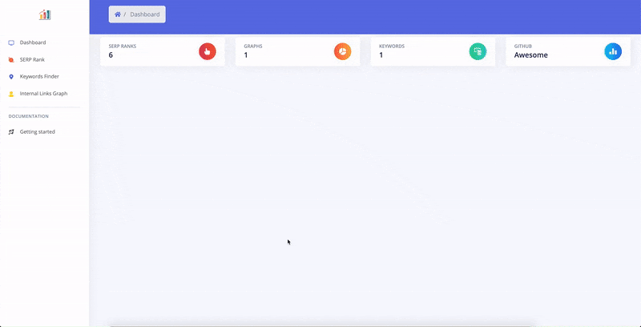
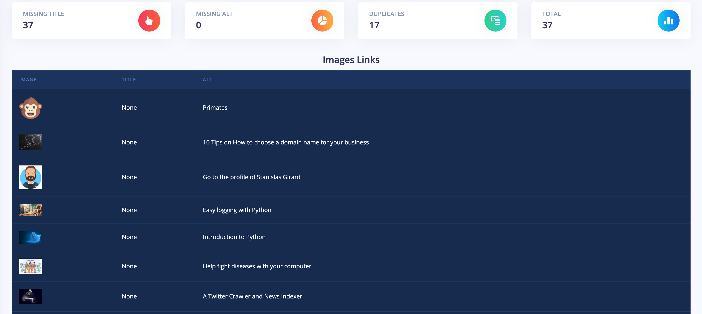

{: .fs-9 }
<p align="center"></p>
{: .fs-6 .fw-300 }

[Get started now](#installation){: .btn .btn-primary .fs-5 .mb-4 .mb-md-0 .mr-2 } [View it on GitHub](https://github.com/StanGirard/seo-audits-toolkit){: .btn .fs-5 .mb-4 .mb-md-0 }

---


# Open source SEO Audits Toolkit

**OSAT** is a collection of multiple tools to help you in your quest for a better SEO. All of these tools have been grouped into a single web app.

I've grown tired of SEO agencies making us pay hundreds of euros for simple tools. I decided to develop **OSAT** to help users find issues in their website and increase their SEO for free. 

<p align="center"></p>

## Why you need it


- It's **free**, easy and open source. 
- It has a growing list of features
- It's easy to install

## Features


- **Lighthouse Score**: Run [Lighthouse](https://developers.google.com/web/tools/lighthouse) Audits and keep track of your scores
- **SERP Rank** - Get the rank of your website on google for specific queries
- **Keywords Finder** - Finds all the Mono,Bi and Trigrams associated to a specific request. Helps you write content faster.
- **Internal Links Graphs** - Creates a graph of your website showing all the connections between your pages.
- **Extract Headers/Links/Images** - Easily extract all the links on your website and their status codes, the headers of a page and all the images.


## Installation

You need: 
- **Python3**
- **[Redis Server](https://redis.io/topics/quickstart)**


```Bash
git clone https://github.com/StanGirard/SEOToolkit
cd SEOToolkit
```

Then install dependencies

```Bash
pip install -r requirements.txt
```

## Running

### Flask
```Bash
python3 run.py
```

### Redis Server
```Bash
redis-server
```

### Celery Worker
```Bash
celery worker -A celery_worker.celery --loglevel=info
```


## Dashboard

You can access the dashboard by going to [localhost:5000](http://localhost:5000)

## Config

If needed create a `.env` file with information that you would like to overload from config.py

## Screenshots

### SERP Rank


### Internal Links Graphs


### Keywords Finder


### Lighthouse Audit


### Images Extractor


